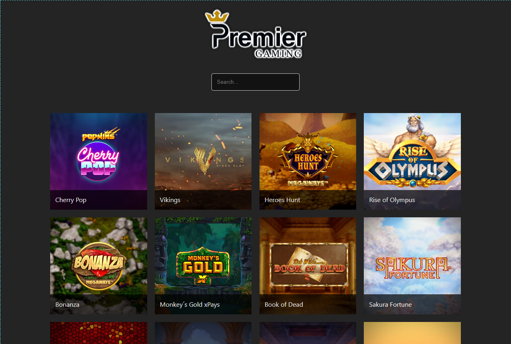
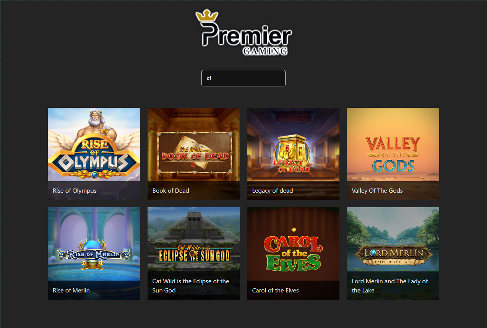
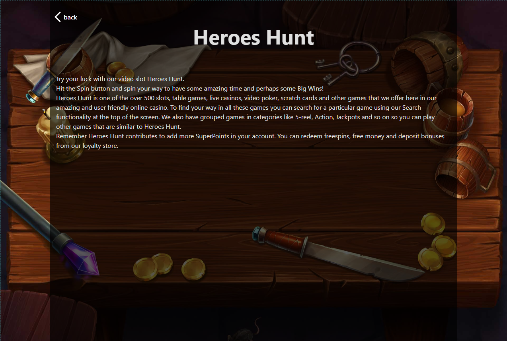

# Casino Lobby Example (Vue.js 3)

## Overview

`casino-lobby-example-vue` is a simple casino lobby web application built using Vue.js 3, TypeScript, Vite, and Vue Router. The project features a search bar with fuzzy search capabilities and allows users to navigate to a game overview by clicking on a game. The site is designed to be responsive to different common viewports.

The site was designed in dark mode due to high sensitivity to light following an eye doctor appointment during the development process.

## Features

- **Search Bar**: Implements fuzzy search to find games.
- **Game Navigation**: Clicking on a game navigates the user to a detailed overview with the game's title and description.
- **Responsive Design**: The site adapts to different common viewports for an optimal user experience on various devices.

## Installation

1. **Clone the repository**:

   ```sh
   git clone https://github.com/Matt-Tanti/casino-lobby-example-vue.git
   cd casino-lobby-example-vue
   ```

2. **Install dependencies**:
   ```sh
   yarn
   ```

## Scripts

- **Development Server**: Start the development server with hot reloading.
  ```sh
  yarn dev
  ```
- **Build**: Compile the TypeScript files and build the project for production.
  ```sh
  yarn build
  ```
- **Linting**: Run ESLint to check for code quality and enforce coding standards.
  ```sh
  yarn lint
  ```
- **Preview**: Preview the production build locally.
  ```sh
  yarn preview
  ```

## Screenshots

### Lobby



### Lobby Filtered



### Game Overview


